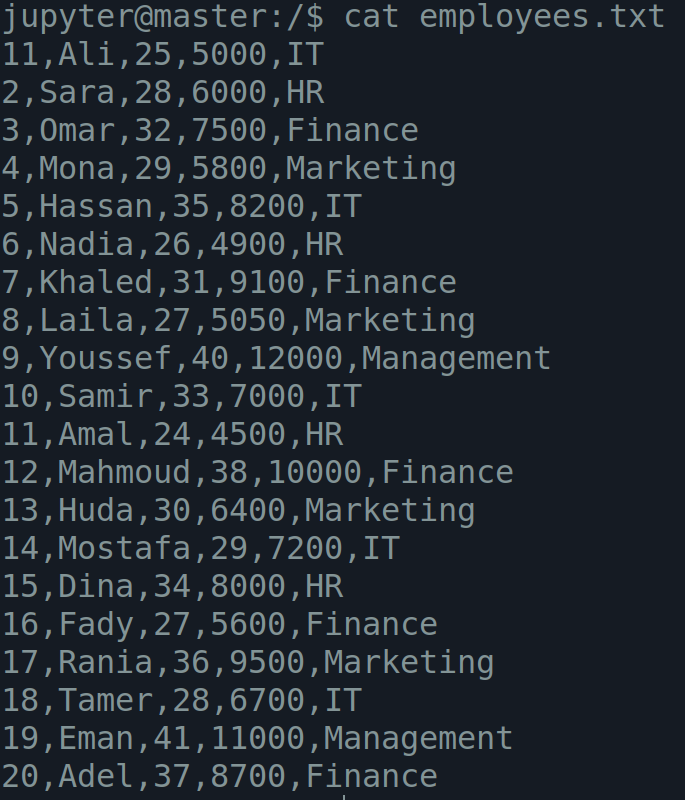
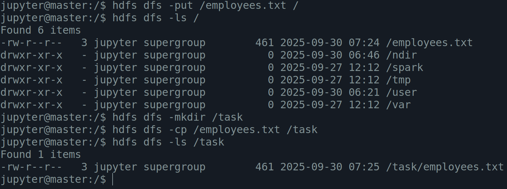
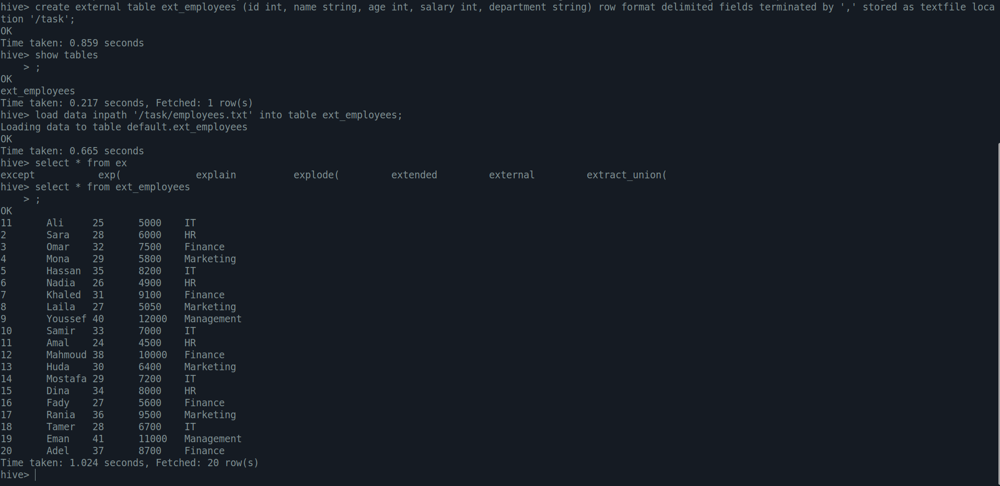
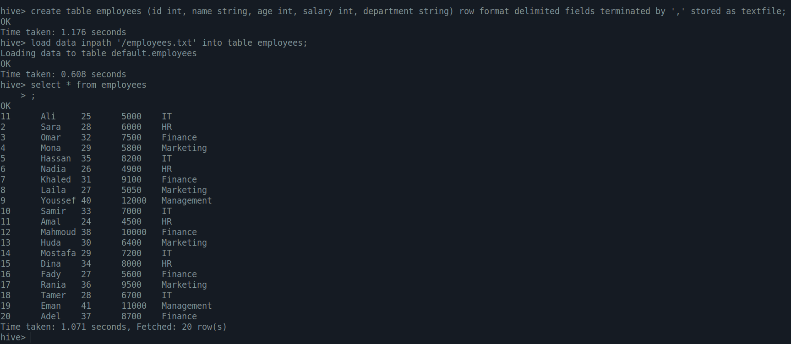
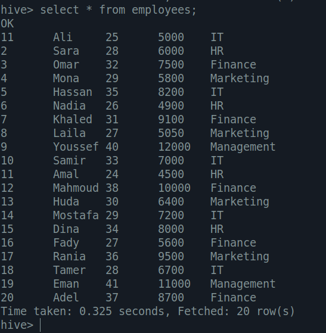
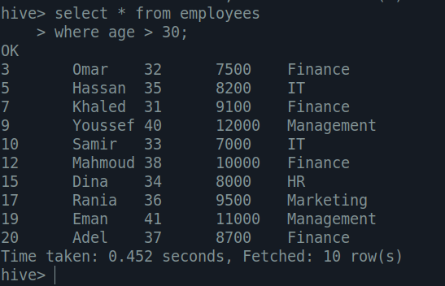
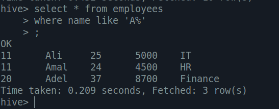
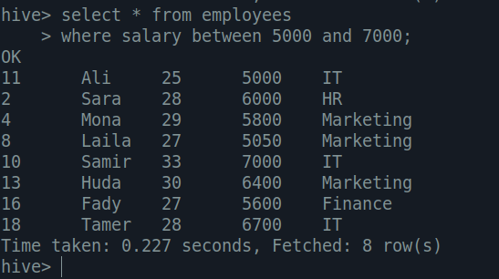
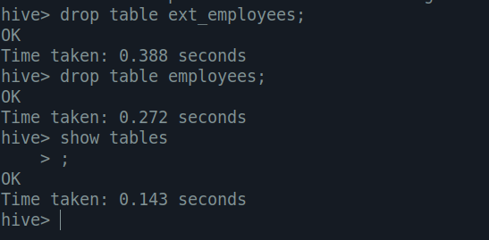
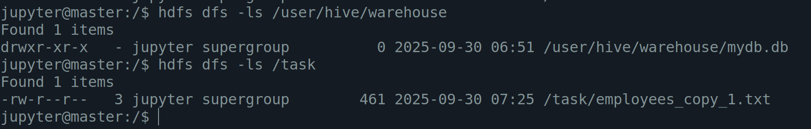

<h1 align="center">Day 04 – Big Data</h1>
<h3 align="center">ITI Minya</h3>
<h3 align="center">Name: Hussein Mohamed</h3>

---

## 🔸 1- Create a text file (employees.txt) with columns: id, name, age, salary, department. Insert at least 8 rows of sample data.

---

## 🔸 2-  Upload the file to HDFS in two different locations (one for external table, one for managed table).

---

## 🔸 3- Create an External Table in Hive that reads data from the first file location.

---

## 🔸 4- Create a Managed Table in Hive and load data into it from the second file location.

---

## 🔸 5.1- Show all employees.

## 🔸 5.2- Select employees older than 30.

## 🔸 5.3- Select all employees whose names start with "A".

## 🔸 5.4- Show employees whose salary is between 5000 and 7000.

---

## 🔸 6- Drop both the external and managed tables.

---

## 🔸 7- After dropping the tables, check the HDFS file locations and explain:

- What happened to the data file used by the external table?
  - only the metadata on hive was removed but still exists on hdfs, because it was referencing it only not woning it
  - note: named _copy_1.txt cause the original file was there so it had to rename it "my explination".
- What happened to the data file used by the managed table?
  - the data file was removed not only the metadata.
