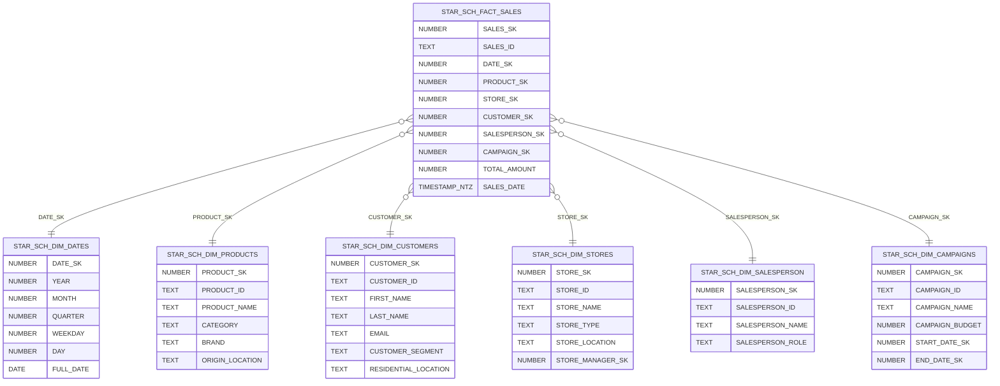

# Sales Analysis

This project demonstrates a complete **sales data analysis workflow** using **Snowflake** as the data warehouse and **Power BI** as the visualization layer.  
The data model follows a **Star Schema** design for efficient querying and analytics.

---

## Data Model

The schema `STAR_SCH` contains a **fact table** for sales transactions and several **dimension tables** describing related business entities such as products, customers, stores, salespersons, and campaigns.

# Process Overview

## Data Source Integration
- Snowflake was connected to Power BI using the native connector.  
- The `STAR_SCH` schema tables were imported directly for modeling and visualization.

## Data Modeling
- A central **Fact Table (`FACT_SALES`)** stores transactional data.  
- **Dimension Tables** provide descriptive context for analytical slicing (time, customer, product, etc.).  
- Relationships were defined in Power BI following the standard **star schema design**.

## Visualization
Multiple Power BI reports and dashboards were created to analyze:
- Sales trends over time  
- Top-performing products and categories  
- Regional performance by store  
- Campaign effectiveness  
- Salesperson performance

## Power BI Dashboards
Below are screenshots from the interactive dashboards built in Power BI:

