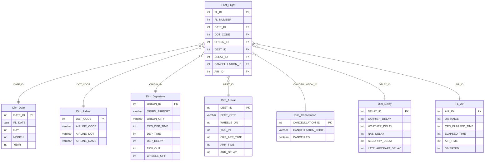

# `lab01` – Flight Delay & Cancellation Dataset Schema

## Overview

- **Dataset**: *Flight Delay and Cancellation Dataset (2019–2023)* by Patrick Zelazko on Kaggle.  
  Includes subsets ranging from the full ~29 million flights to a sampled ~3 million rows (`flights_sample_3m.csv`) for efficient analysis. ([kaggle.com](https://www.kaggle.com/datasets/patrickzel/flight-delay-and-cancellation-dataset-2019-2023?utm_source=chatgpt.com))  
- **Objective**: Design a data warehouse schema (star schema) to support analytical reporting on flight performance, delays, cancellations, and related metrics.

## Schema Design

Below is the **Mermaid ER diagram** representing the schema I developed for this lab:

