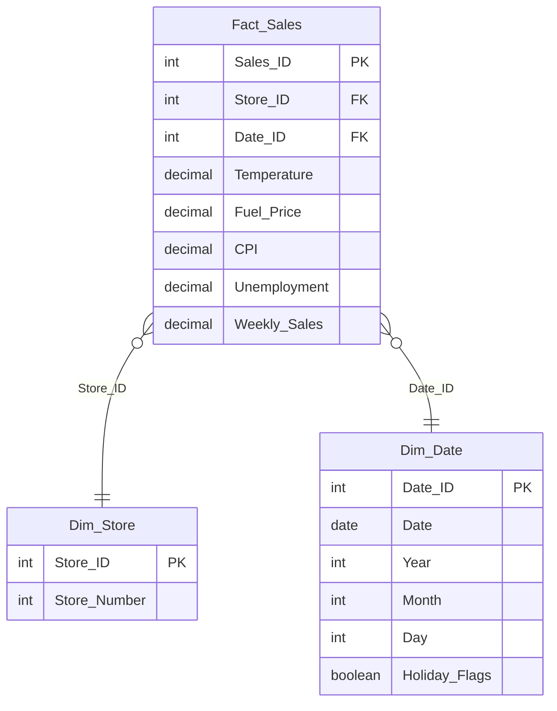
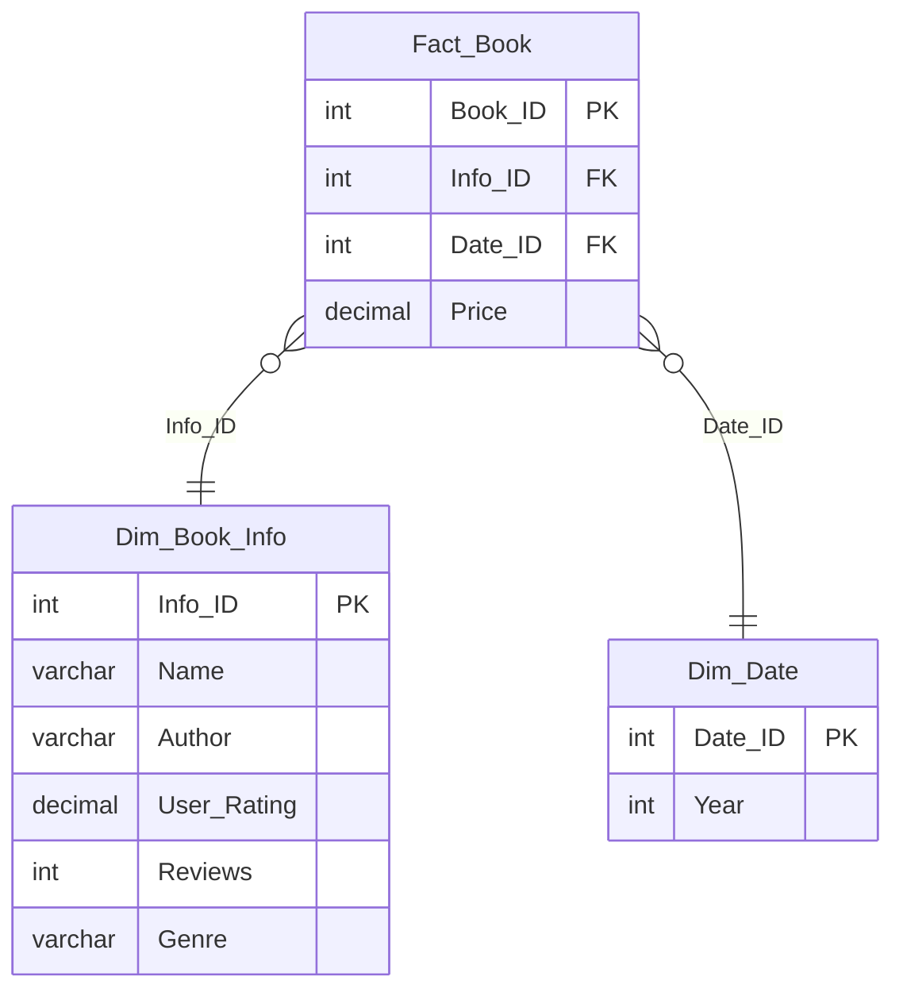
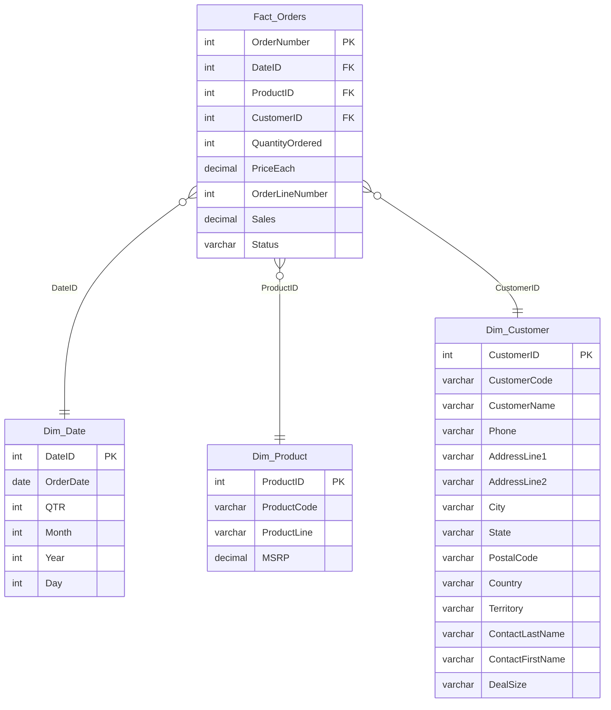

# `Assignments` – Multiple Dataset Schemas (Walmart, Amazon Books, Orders)

## Overview

- **Datasets**:  
  1. *Walmart Sales Forecasting Dataset* ([Kaggle](https://www.kaggle.com/datasets/mikhail1681/walmart-sales)) – weekly sales across different stores with external influencing factors.  
  2. *Amazon Top 50 Bestselling Books (2009–2019)* ([Kaggle](https://www.kaggle.com/datasets/sootersaalu/amazon-top-50-bestselling-books-2009-2019/data)) – information about bestselling books with ratings, reviews, and genres.  
  3. *Orders & Customers Dataset* ([Google Drive](https://drive.google.com/file/d/1TV-_ObwTBPlVd_lax5IgifvgAmpxJ5MQ/view)) – order management including products, customers, and dates.  

- **Objective**:  
  Design star schemas for each dataset to support analytical queries in sales forecasting, book performance analysis, and order management.  

---

## Schema 1 – Walmart Sales

---

## Schema 2 – Amazon Bestselling Books

---

## Schema 3 – Orders & Customers

