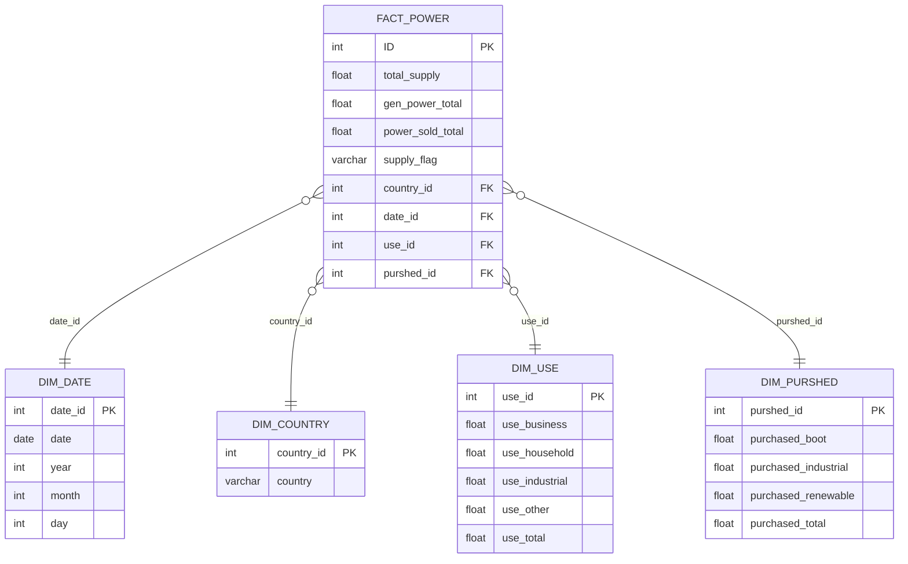

<h1 align = "center"> Egypt Electricity Production & Consumption
  
## Introduction
This project develops an ETL pipeline and Data Warehouse schema using the **Egypt Electricity Production & Consumption** dataset to analyze energy trends and consumption patterns over time.

## About the dataset
The dataset includes **monthly information about electricity production and consumption in Egypt**, measured in **million kilowatt-hours (MM kWh)**.  
It is obtained from the **Central Bank of Egypt (CBE)** and provides a reliable source for studying national energy usage.

## Objectives
- Extract, Transform, and Load (ETL) the raw dataset using **Python**.
- Design a **Star Schema** suitable for a Data Warehouse environment.
- Populate fact and dimension tables for analytics.
- Enable time-series analysis of electricity production and consumption.
- Explore correlations between production and consumption patterns.

## Dataset
- **Source:** [Alphacast - Egypt Electricity Production & Consumption](https://www.alphacast.io/datasets/electricity-production-consumption-39666)  
- **Frequency:** Monthly  
- **Measures:** Electricity Production (MM kWh), Electricity Consumption (MM kWh)  
- **Time Coverage:** 2013 – 2024 (depending on data availability)

## ETL 
```python
# %%
# Importing the data 
import pandas as pd

df = pd.read_csv("39666.csv")

# %%
# Show Info About The Dataset
#df
df.head()
#df.shape

# Check For Nulls
#df.isnull().sum()

# Check For Duplicates
#df.duplicated()

# %%
# Also There is no Full Duplicates but we must check for any other types
# Scince There is 12 category * 12 month so every year must have 144 row 
# Reforfmat the date into Year-Month-Day
df['Date'] = pd.to_datetime(df['Date'])
df['Year'] = df['Date'].dt.year
df['Month'] = df['Date'].dt.month
df['Day'] = df['Date'].dt.day
# Then count rows in every year

year_counts = df["Year"].value_counts().sort_index()
year_counts

# %%
# Show Duplicated Values(Year and Month)
all_months = set(range(1, 13))

for year, group in df.groupby("Year"):
    months_present = set(group["Month"].unique())
    missing_months = all_months - months_present
    
    if len(months_present) != 12:
        print(f"Year {year} has {len(months_present)} months recorded")
        print(f"Missing months: {sorted(list(missing_months))}\n")
# We get from this the needed values to be deleted

# %%
# Show the Real Null values
month_counts = (
    df.groupby(["Year", "Month"])
    .size()
    .reset_index(name="Count")
    .sort_values(["Year", "Month"])
)

for _, row in month_counts.iterrows():
    if row["Count"] != 12:
        print(f"\nYear {int(row['Year'])}, Month {int(row['Month'])} has {row['Count']} values")


# %%
# Now we have clear vision of the Nulls and Duplicates
# Let's Clear the dataset
df = df.drop_duplicates(subset=["Year", "Month", "Value"])

# %%
# Show the Real Null values again
month_counts = (
    df.groupby(["Year", "Month"])
    .size()
    .reset_index(name="Count")
    .sort_values(["Year", "Month"])
)

for _, row in month_counts.iterrows():
    if row["Count"] != 12:
        print(f"\nYear {int(row['Year'])}, Month {int(row['Month'])} has {row['Count']} values")


# Zero Results! Duplicates are cleared


# %%
df["Category_Combined"] = df["Category 1"].fillna("") + ", " + df["Category 2"].fillna("")
df["Category_Combined"] = df["Category_Combined"].str.strip(", ")

counts = df["Category_Combined"].value_counts().reset_index()
counts.columns = ["Category_Combined", "Count"]

counts.to_csv("Categories.csv")

# %%
# There is Categories with differenet names only we will unify the naming
replace_map = {
    "Surplus Of Industrial Companies": "Industrial Companies",
    "New & Renewable ( Winds + Solar Energy )": "New & Renewable ( Wind + Solar Energy )",
    "Boot & International Electrical Interconnection Countries": "Boot",
    "International Electrical Interconnection Countries": "Boot"
}

df["Category 2"] = df["Category 2"].replace(replace_map)

# %%
# PIIIIIIIIIIIIIIIIIIIVOT
df["Category"] = df["Category 1"] + ", " + df["Category 2"]

# Pivot Table
pivot_df = df.pivot_table(
    index=["Date","Year", "Month", "Day", "Country"], 
    columns="Category", 
    values="Value",
    aggfunc="sum"   
).reset_index()


pivot_df.to_csv("pivot_categories.csv", index=False)


# %%
pivot_df.shape

# %%
# Clear names
pivot_df = pivot_df.rename(columns={
    "Date": "date",
    "Year": "year",
    "Month": "month",
    "Day": "day",
    "Country": "country",
    "Generated  Power, Total": "gen_power_total",
    "Power Sold, Total": "power_sold_total",
    "Purchased Power, Boot": "purchased_boot",
    "Purchased Power, Industrial Companies": "purchased_industrial",
    "Purchased Power, New & Renewable ( Wind + Solar Energy )": "purchased_renewable",
    "Purchased Power, Total": "purchased_total",
    "Total Generated & Purchased Power, Total": "total_supply",
    "Total Uses, Business": "use_business",
    "Total Uses, Household": "use_household",
    "Total Uses, Industrial": "use_industrial",
    "Total Uses, Other": "use_other",
    "Total Uses, Total": "use_total"
})


# %%
# Creating the schema(star)
# Dim_Date
dim_date = (
    pivot_df[["date","year","month","day"]]
    .drop_duplicates()
    .sort_values(["date"])
    .reset_index(drop=True)
)
dim_date["date_id"] = range(1, len(dim_date) + 1)

# Dim_Country
dim_country = (
    pivot_df[["country"]]
    .drop_duplicates()
    .sort_values(["country"])
    .reset_index(drop=True)
)
dim_country["country_id"] = range(1, len(dim_country) + 1)

# Dim_Use
use_cols = ["use_business","use_household","use_industrial","use_other","use_total"]
dim_use = (
    pivot_df[use_cols]
    .drop_duplicates()
    .reset_index(drop=True)
)
dim_use["use_id"] = range(1, len(dim_use) + 1)

# Dim_Purshed
purshed_cols = ["purchased_boot","purchased_industrial","purchased_renewable","purchased_total"]
dim_purshed = (
    pivot_df[purshed_cols]
    .drop_duplicates()
    .reset_index(drop=True)
)
dim_purshed["purshed_id"] = range(1, len(dim_purshed) + 1)

# Fact
fact_power = (
    pivot_df
    .merge(dim_date, on=["date","year","month","day"], how="left")
    .merge(dim_country, on="country", how="left")
    .merge(dim_use, on=use_cols, how="left")
    .merge(dim_purshed, on=purshed_cols, how="left")
)

fact_power = fact_power[[
    "total_supply","gen_power_total","power_sold_total",
    "country_id","date_id","use_id","purshed_id"
]].copy()

fact_power.insert(0, "ID", range(1, len(fact_power) + 1))


# %%
dim_date[["date_id","date","year","month","day"]].to_csv("dim_date.csv", index=False)
dim_country[["country_id","country"]].to_csv("dim_country.csv", index=False)
dim_use[["use_id"] + use_cols].to_csv("dim_use.csv", index=False)
dim_purshed[["purshed_id"] + purshed_cols].to_csv("dim_purshed.csv", index=False)
fact_power.to_csv("fact_power.csv", index=False)

# %%
# Flag indicator on total_supply

def supply_flag(x):
    if x > 20000:
        return "High"
    elif 15000 < x <= 20000:
        return "Medium"
    else:
        return "Low"

fact_power["supply_flag"] = fact_power["total_supply"].apply(supply_flag)
fact_power.to_csv("fact_power.csv", index=False)

```

## Schema


