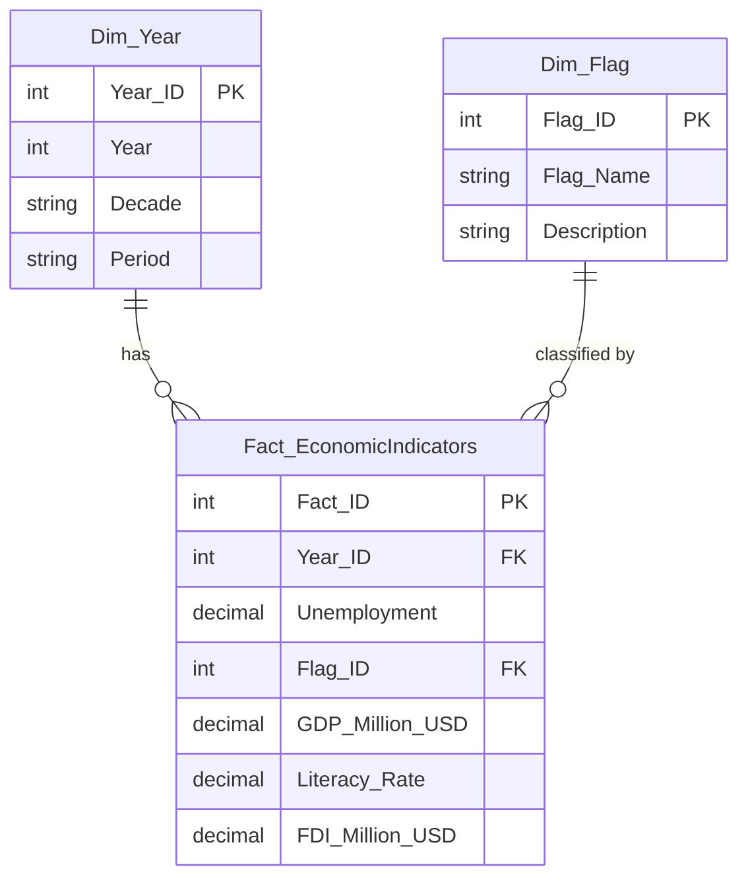
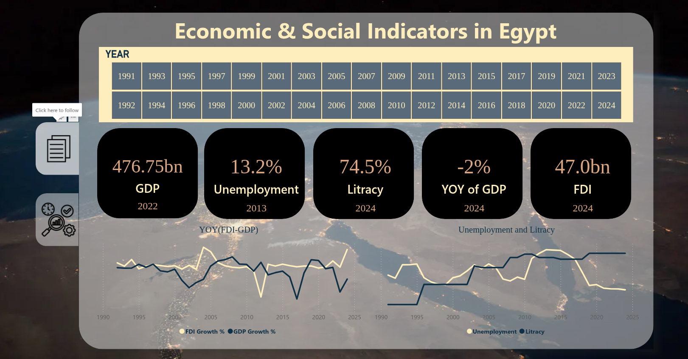
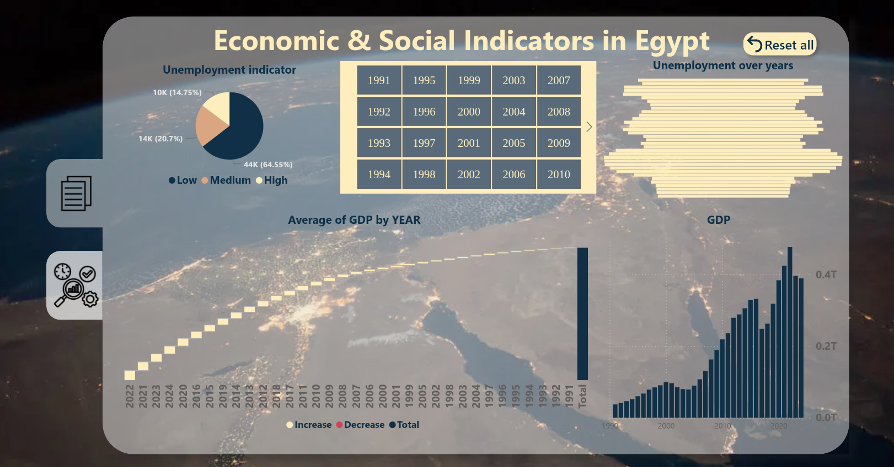

<h1 align = "center"> Egypt Unemployment Analysis (1991–2024)

## Datasets

1. **Unemployment Rate (UEM)**  
   - Source: [World Bank - Unemployment, total (% of total labor force)](https://data.worldbank.org/indicator/SL.UEM.TOTL.ZS?locations=EG)  
   - Measure: Percentage of total labor force (%)

2. **Gross Domestic Product (GDP)**  
   - Source: [World Bank - GDP (current US$)](https://data.worldbank.org/indicator/NY.GDP.MKTP.CD?locations=EG)  
   - Measure: Current GDP in **Million US$**

3. **Literacy Rate**  
   - Source: [World Bank - Egypt Country Data](https://data.worldbank.org/country/egypt-arab-rep)  
   - Measure: Percentage of population (%)

4. **Foreign Direct Investment (FDI)**  
   - Source: [Macrotrends - Egypt Foreign Direct Investment](https://www.macrotrends.net/datasets/global-metrics/countries/egy/egypt/foreign-direct-investment)  
   - Measure: **Percentage of GDP (%)**
---

## Objective
Build a Data Warehouse to analyze the relationship between **Unemployment in Egypt** and other economic and social indicators (1991–2024), including:
- GDP growth (Million US$)
- Literacy rate (%)
- Foreign Direct Investment (FDI as % of GDP)

---

## ELT

## Diagram 

## Dashboard

