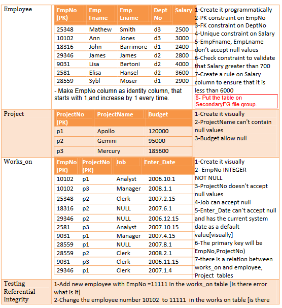
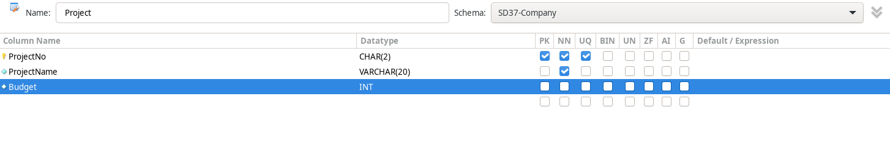

<h1 align="center">Day 01 – Databases</h1>
<h3 align="center">ITI Minya – Round 1</h3>
<h3 align="center">Name: Hussein Mohamed</h3>

---

## 🔸 Q2: Create the following tables with all the required information and insert the required data as specified in each table using `INSERT` statements (at least two rows):

### a. Table Name: **Department** (Programmatically)

#### i. Columns:
1. **DeptNo**: `INT`, Primary Key.  
2. **DeptName**: `NVARCHAR(20)`  
   - **Why did we choose `NVARCHAR` data type and not `NCHAR` or `VARCHAR`?**  
3. **Location**: `NCHAR(2)`  
   - **Why did we choose `NCHAR` data type and not `NVARCHAR`?**  
   - **Can we make the data type for that column as `CHAR(2)`?**  

#### ii. Additional Requirements:
- Table values of **Location** should be one of the following only: `NY`, `DS`, `KW`.  
- Do what’s required to ensure the user **cannot enter any other values**.

#### iii. Default Value:
- Make the **Location** column value **"NY"** as the default if the user doesn’t insert it.

```sql
CREATE TABLE Department
(
    DeptNo INT,
    DeptName NVARCHAR(20),
    -- nvarchar not nchar because the size of the columns may vary
    Location NCHAR(2) DEFAULT 'NY',
    -- it's known size so we used nchar not nvarchar
    -- yes we can make it char if it's in English

    CONSTRAINT DeptNo_Department_PK PRIMARY KEY (DeptNo),
    CONSTRAINT location_Department_chk CHECK (Location IN ('NY','DS','KW'))
);
```
### b. Create the following tables, and use Suitable data types and constraints:



```sql
-- Employee
CREATE TABLE Employee
(
    EmpNo INT IDINTITY(1,1),
    EmpFName NVARCHAR(20) NOT NULL,
    EmpLName NVARCHAR(20) NOT NULL,

    DepNo CHAR(2),
    salary INT UNIQUE,
    
    CONSTRAINT EmpNo_Employee_PK PRIMARY KEY (EmpNo),
    CONSTRAINT DepNo_Employee_FK FOREIGN KEY (DepNo) REFERENCES Department(DepNo),
    CONSTRAINT salary_Employee_chk CHECK (salary > 700 AND salary < 6000)
);
```


```sql
-- works_on
CREATE TABLE `SD37-Company`.`Works_on` (
  `EmpNo` INT NOT NULL,
  `ProjectNo` CHAR(2) NOT NULL,
  `job` VARCHAR(20) NULL,
  `Enter_Date` DATETIME NOT NULL DEFAULT CURRENT_TIMESTAMP,
  PRIMARY KEY (`EmpNo`, `ProjectNo`),
  CONSTRAINT `EmpNo`
    FOREIGN KEY (`EmpNo`)
    REFERENCES `SD37-Company`.`Employee` (`EmpNo`)
    ON DELETE RESTRICT
    ON UPDATE RESTRICT);
```


--- 

### 3. Modify the tables as follows:
#### a. Add `TelephoneNumber` column to the **Employee** table (Programmatically).
#### b. Drop the `TelephoneNumber` column from the **Employee** table (Programmatically).
```sql

ALTER TABLE Employee
ADD COLUMN TelephoneNumber varchar(20);

ALTER TABLE Employee
DROP COLUMN TelephoneNumber;

```

### 4. Create the following schema and transfer the following tables to it:

#### a. Schema Name: **Company**
- **i.** Transfer the `Department` table (Programmatically).
- **ii.** Transfer the `Employee` table (Visually).

```sql
ALTER SCHEMA Company TRANSFER [SD37-Company].Department;
```


