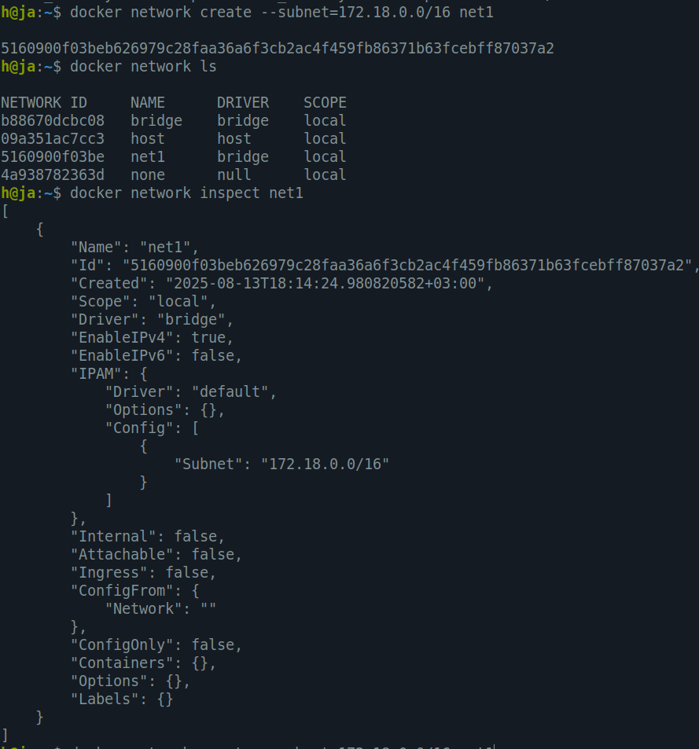
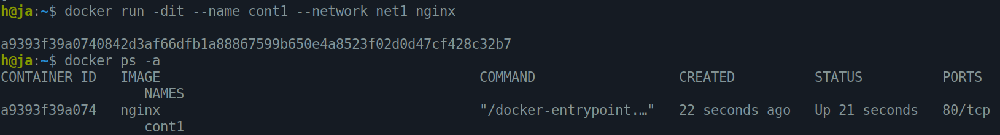
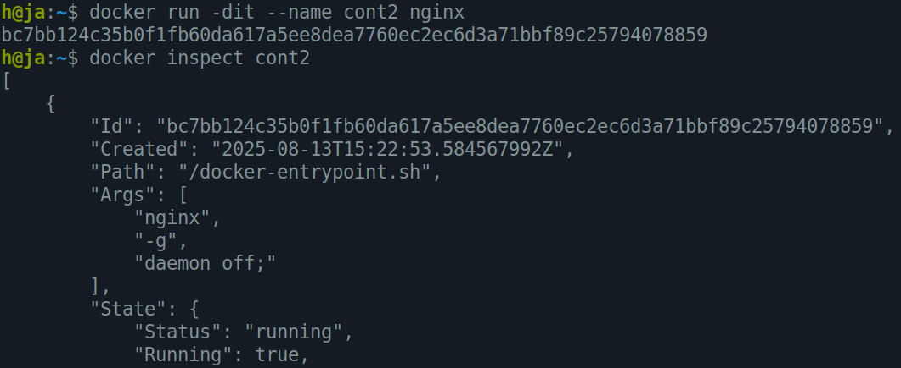
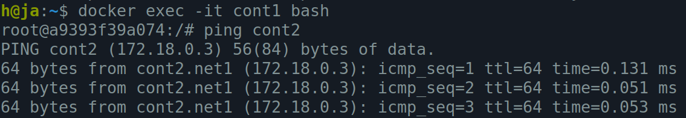

# Docker-lab 01  
---

## 🔸 Q1: Pinging two containers in different networks

### 1. Create a new network with `172.18.0.0/16` IP range
```bash
docker network create --subnet=172.18.0.0/16 net1
```


---

### 2. Attach an Nginx container (`cont1`) to the new network
```bash
docker run -dit --name cont1 --network net1 nginx
```


---

### 3. Attach another Nginx container (`cont2`) to the default network
```bash
docker run -dit --name cont2 nginx
```


---

### 4. Ping from `cont1` to `cont2`
No — it can’t connect to a container on a different network.  


---

### 5. How to make it work
1. Connect `cont2` to the new network `net1`:
```bash
docker network connect net1 cont2
```
2. Try pinging again:  

