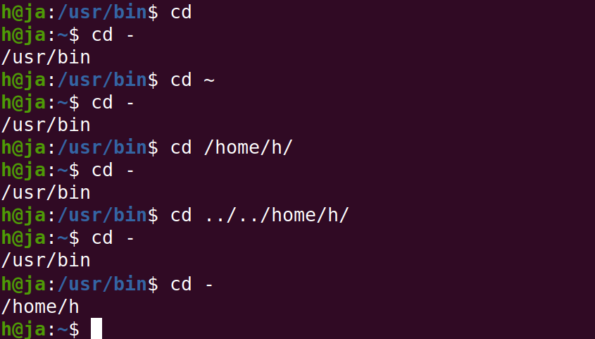
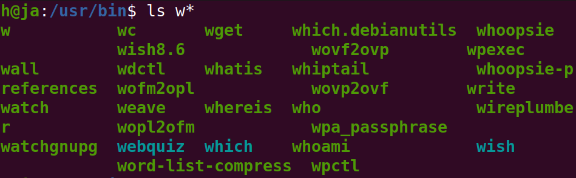
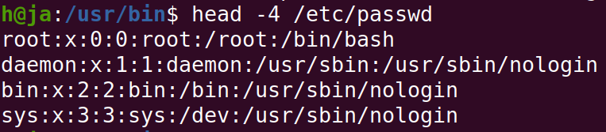
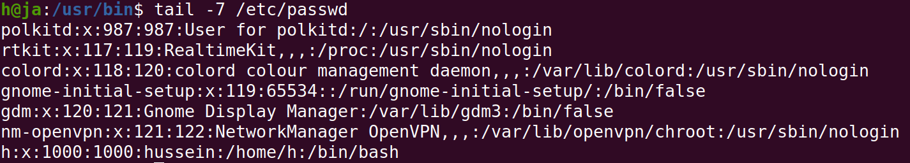
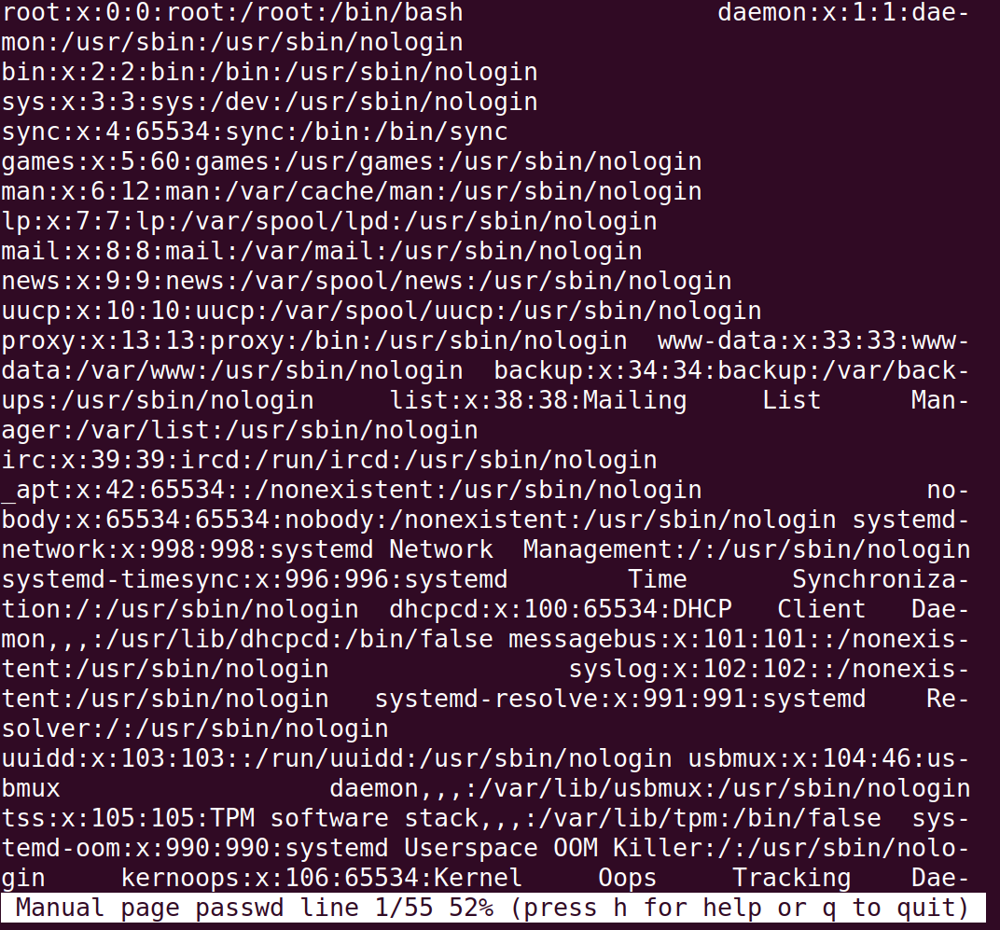

<h1 align="center">Day 01 – Linux & Shell</h1>
<h3 align="center">ITI Minya – Round 1</h3>
<h3 align="center">Name: Hussein Mohamed</h3>

---

## 🔸 Q2: What is the difference between cat and more command?

- cat shows the content of the argument in the terminal full text
- more shows the content of the argument in page by page format scrolling with space or arrows

---
## 🔸 Q3: What is the difference between rm and rmdir using man?

- man rm > removes files and directories based on the given option"-r, -d,..."
- man rmdir > removes empty directroies

---
## 🔸 Q7: You are in /usr/bin, list four ways to go to your home directory

- cd
- cd ~
- cd /home/h
- cd ../../home/h/
- if it was there before > cd -

---
## 🔸 Q8: List Linux commands in /usr/bin that start with letter w

- ls w*

---
## 🔸 Q9: Display the first 4 lines of /etc/passwd

- head -4 /etc/passwd

---
## 🔸 Q10: Display the last 7 lines of /etc/passwd

- tail -7 /etc/passwd

---
## 🔸 Q11: Display the man page of the passwd file.

- man passwd

