<h1 align="center">Day 03 – Linux & Shell</h1>
<h3 align="center">ITI Minya – Round 1</h3>
<h3 align="center">Name: Hussein Mohamed</h3>

---

## 🔸 Lab02-Q11: Create a folder called myteam in your home directory and change its permissions to read only for the owner.
- `pwd` > /home/h 
- `mkdir myteam`
- `chmod 400 myteam/`
- `ls -l`
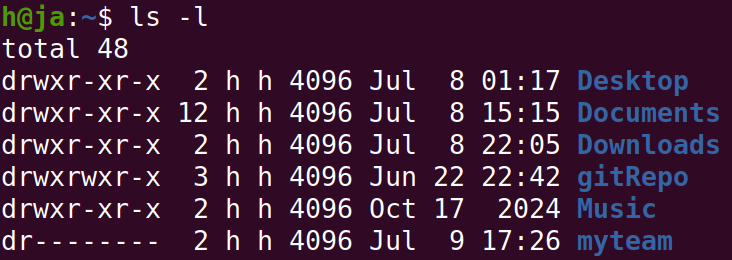

---

## 🔸 Lab02-Q12: Log out and log in by another user
- su - ali

---

## 🔸 Lab02-Q13: Try to access (by cd command) the folder (myteam)
- `cd /home/h/myteam`
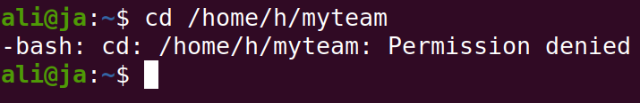

---

## 🔸 Lab02-Q14: Using the command Line: Change the permissions of oldpasswd file to give owner read and write permissions and for group write and execute and execute only for the others (using chmod in 2 different ways)
- `chmod u=rw,g=wx,o=x oldpasswd`
- `chmod 631 oldpasswd`
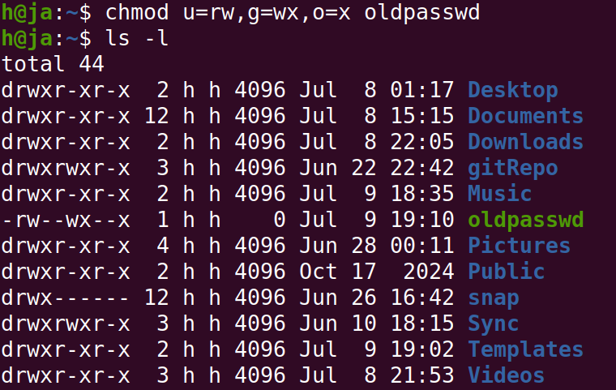

---

## 🔸 Lab02-Q15: Change your default permissions to be no permission to everyone then create a directory and a file to verify.
- `umask 777`
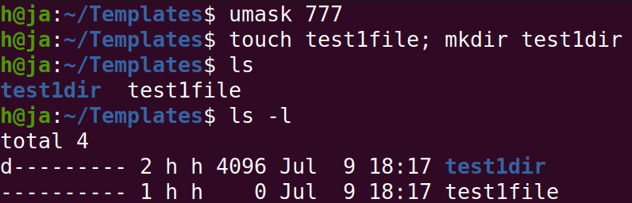

---

## 🔸 Lab02-Q16: Create a file with permission 444. Try to edit it and to remove it. Note what happens.
- `chmod 444 file1`
- when trying to edit it says that it's write-protected
- when trying to delete it asks for confirmation
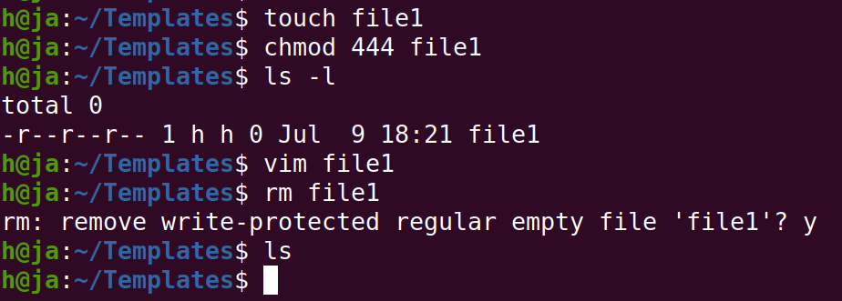
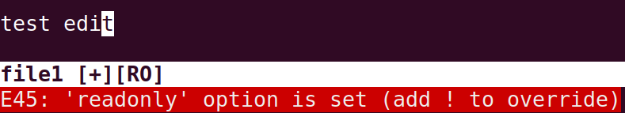

---

## 🔸 Lab02-Q17: What is the difference between the “x” permission for a file and for a directory?
- "x" permission for a file: enables executing the file, e.g. a bash script
- "x" permission for a directory: enables entering (cd into) the directory

---

## 🔸 Lab02-Q18: What are the minimum permissions needed for:
- Copy a directory (permission for source directory and permissions for target parent directory)
  - "read" permission for source, "write and execute" permissions for the target
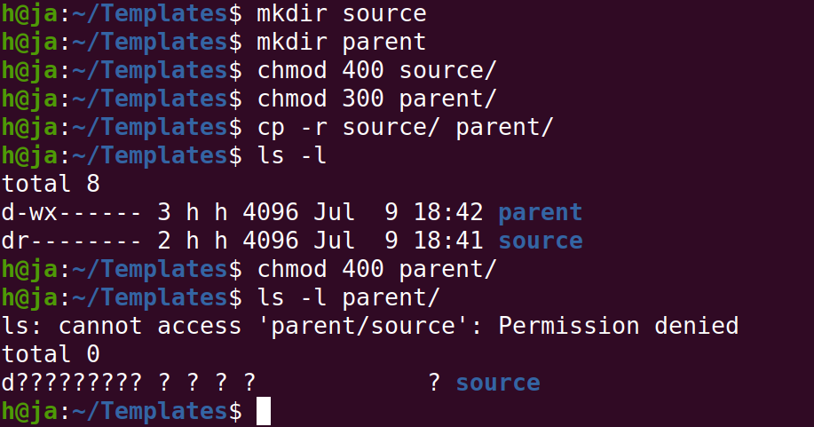
- Copy a file (permission for source file and permission for target parent directory)
  - "read" permission for source, "write and execute" permissions for the target
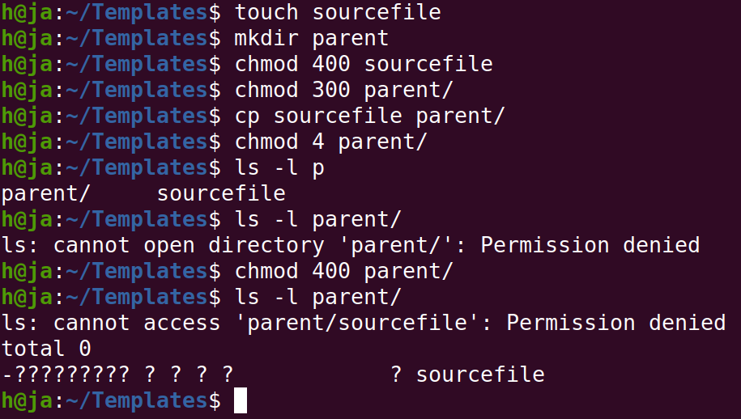
- Delete a file
  - No permission is required on the file itself, but "write and execute" permissions are needed on the directory containing the file.
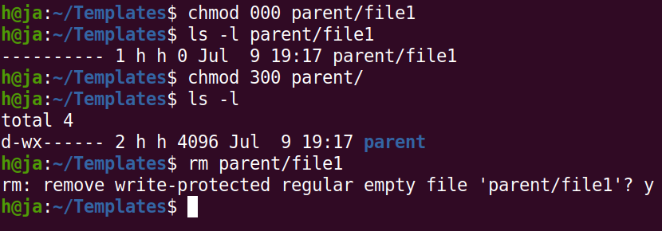
- Change to a directory
  - "execute" permission
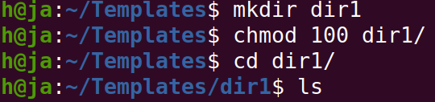
- List a directory content (ls command)
  - "read" permission
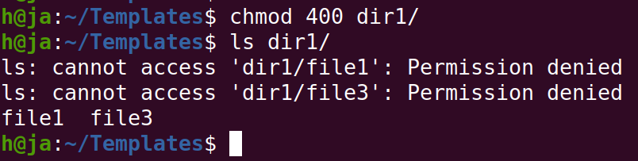
- View a file content (more/cat command)
  - "read" permission
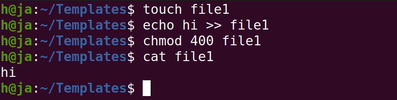
- Modify a file's content
  - "write" permission
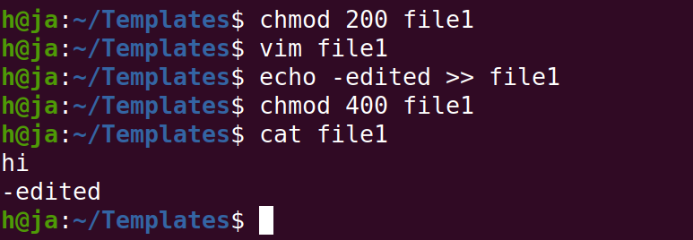

---

## 🔸 Lab03-Q1: Using vi write your CV in the file mycv. Your CV should include your name, age,school, college, experience,...
- `vim mycv`
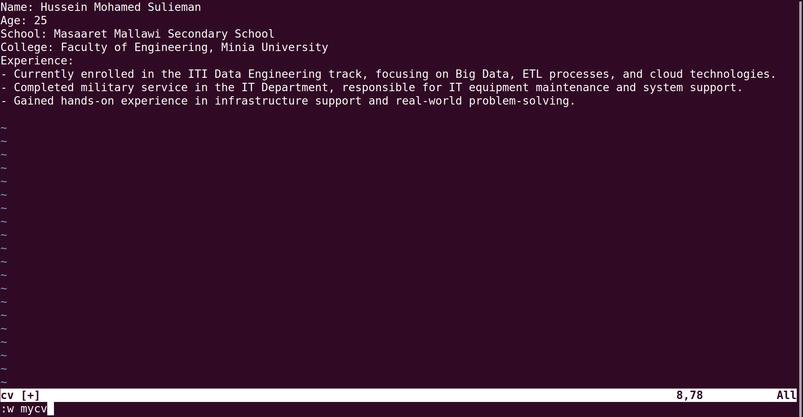

---

## 🔸 Lab03-Q2: Open mycv file using vi command then: Without using arrows state how to:
- Move the cursor down one line at time. >> j
- Move the cursor up one line at time. >> k
- Search for word age >> /Age
- Step to line 5 (assuming that you are in line 1 and file is more than 5 lines). >> :5
- Delete the line you are on and line 5. >> dd
- How to step to the end of line and change to writing mode in one-step. >> A

---

## 🔸 Lab03-Q10: Create a Bash shell alias named ls for the “ls –l” command
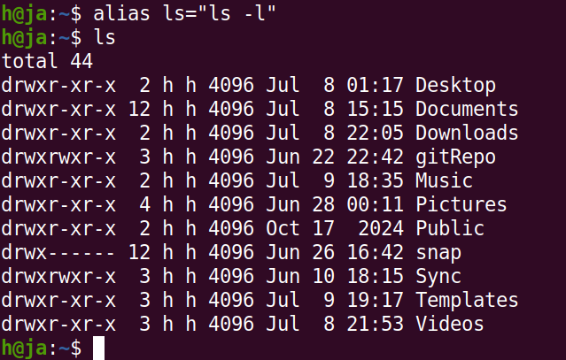

