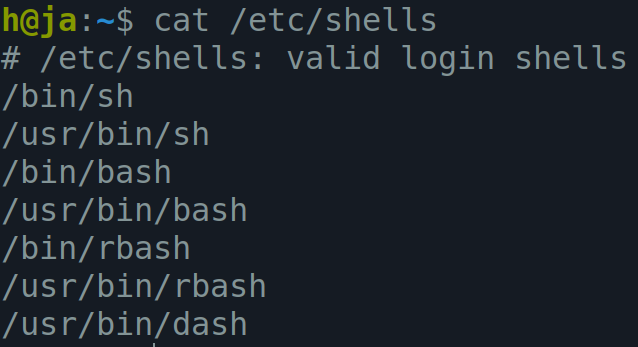
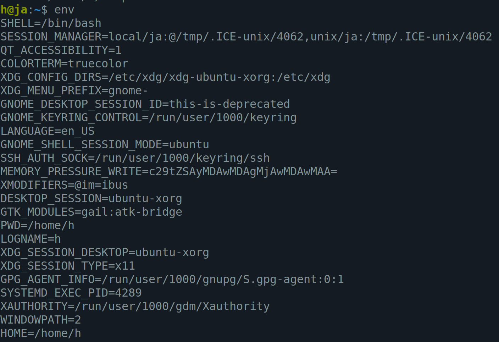
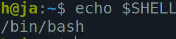
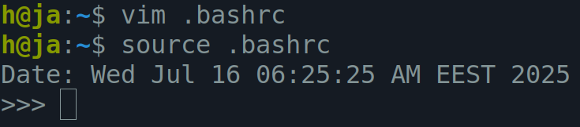
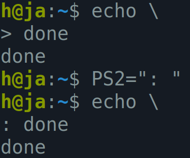

<h1 align="center">Day 04 – Linux & Shell</h1>
<h3 align="center">ITI Minya – Round 1</h3>
<h3 align="center">Name: Hussein Mohamed</h3>

---

## 🔸 Lab03-Q3: List the available shells in your system.

`cat /etc/shells`



---

## 🔸 Lab03-Q4: List the environment variables in your current shell.

`env`



---

## 🔸 Lab03-Q5: What are the commands that list the value of a specific variable?

```
echo $VARIABLE_NAME
printenv VARIABLE_NAME
```

---

## 🔸 Lab03-Q6: Display your current shell name.

`echo $SHELL`




---

## 🔸 Lab03-Q7: State the initialization files of: sh, ksh, bash.

sh:
/etc/profile, ~/.profile

ksh:
/etc/profile, ~/.profile, ~/.kshrc

bash:
/etc/profile, ~/.bash_profile, ~/.bash_login, ~/.profile, ~/.bashrc

---


## 🔸 Lab03-Q9: Edit in your profile to display date at login and change your prompt permanently.

```
vim ~/.bashrc
#add this
echo "Date: $(date)"
#to change prompt
PS1=">"
```




---

## 🔸 Lab03-Q9: Execute the following commands:
```
echo \ then press enter
What is the purpose of \ ?
Notice the prompt ”>” what is that? and how can you change it from “>” to “:”.
```
- `\` means to go to next line
- `>` means that the command is not yet completed
- `PS2=": "` will change it to ":"


