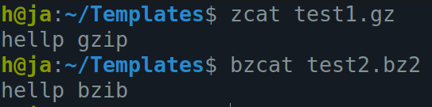

<h1 align="center">Day 05 – Linux & Shell</h1>
<h3 align="center">ITI Minya – Round 1</h3>
<h3 align="center">Name: Hussein Mohamed</h3>

---

## 🔸 Lab04-Q1: List the user commands and redirect the output to /tmp/commands.list
- `ls /usr/bin >  /tmp/commands.list`

---

## 🔸 Lab04-Q2: Count the number of user commands
- `wc -l /tmp/commands.list`

---

## 🔸 Lab04-Q3: Get all the users names whose first character in their login is ‘h’.
- `cut -d: -f1 /etc/passwd | grep "^h"`

---

## 🔸 Lab04-Q4: Get the logins name and full names (comment) of logins starts with “g”.
- `cut -d: -f1,5 /etc/passwd | grep "^h"`

---

## 🔸 Lab04-Q5: Save the output of the last command sorted by their full names in a file.
- `cut -d: -f1,5 /etc/passwd | grep "^h" | sort -k2 > usrs_sorted`

---

## 🔸 Lab04-Q6: Display the number of users who is logged now to the system.
- `who | wc -l`

---

## 🔸 Lab04-Q7: Display lines 7 to line 10 of /etc/passwd file
head -n 10 /etc/passwd | tail -n 4

---

## 🔸 Lab04-Q8: What happens if you execute:
- `cat filename1 | cat filename2`
  - don't merge, Displays the second only
  - 
- `ls | rm`
  - gives error in no file names "arguments" provided
- `ls /etc/passwd | wc –l`
  - without -l it will give 1 1 12, but when -l and no file then it gives erro
  - 

---

## 🔸 Lab04-Processes:
### 1. Issue the command sleep 100.
### 2.Stop the last command.
### 3.Resume the last command in the background
### 4.Issue the jobs command and see its output.
### 5.Send the sleep command to the foreground and send it again to the background.
### 6.Kill the sleep command.
- 

### 7.Display your processes only
  - `ps -u h`
### 8.Display all processes except yours
  - `ps -e -o user,pid,cmd | grep -v h`
### 9.Use the pgrep command to list your processes only
  - `pgrep -u h`
### 10. Kill your processes only. 
  - `pkill -u h`

---

## 🔸 Lab05-Q1: Compress a file by gzip and bzip2 commands and decompress it again. State the differences between two commands.
- as showen gzip takes less time, gives a bigger compresed file
- bzip2 takes more time, gives a smaller compressed file 

---

## 🔸 Lab05-Q2: What is the command used to view the content of a compressed file.
`zcat`
`bzcat`

---

## 🔸 Lab05-Q3: Backup etc directory using tar utility.
`tar -cf etc_backup.tar /etc`

---

## 🔸 Lab05-Q4: Starting from your home directory, find all files that were modified in the last two day.

`find ~ -type f -mtime -2`

---

## 🔸 Lab05-Q5: Starting from /etc , find files owned by root user.

`find /etc -type f -user root`

---

## 🔸 Lab05-Q6: Find all directories in your home directory.
`find ~ -type d`

---

