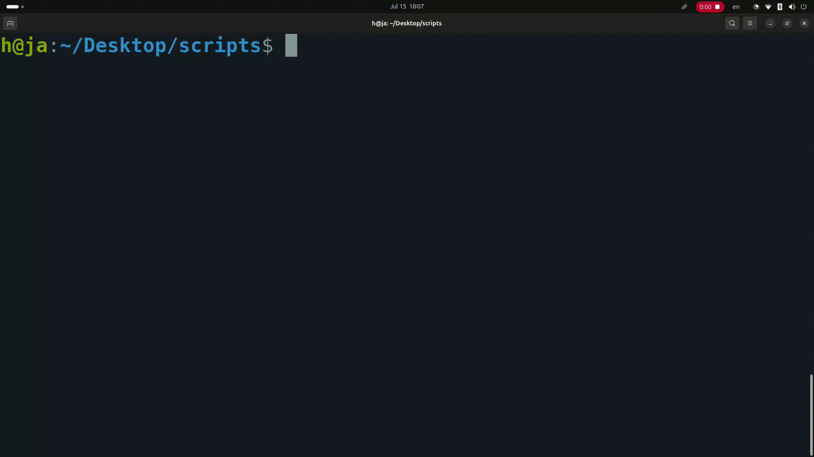

<h1 align="center">Day 06 – Linux & Shell</h1>
<h3 align="center">ITI Minya – Round 1</h3>
<h3 align="center">Name: Hussein Mohamed</h3>

---

## 🔸 Lab05-Q1: Create a script that asks for the user's name and then sends a griting to him.
```
#!/bin/bash

read -p "Please nter your name: " username
echo hello $username

```


---

## 🔸 Lab05-Q2: Create a script called "mycp" where it copies a file to another and copies multiple files to directory

```
#!/bin/bash

# We depend on the type of arguments
# If the last argument is a dir so it copies all previous files to it
# If the second argument is a file it copies the first file to it
# If there is more than two and the last argument is a file it gives error

dest=${@: -1}
sources=("${@:1:$#-1}")

if [ -d "$dest" ]; then
    cp "${sources[@]}" "$dest"
else
    if [ ${#sources[@]} -eq 1 ]; then
        cp "${sources[0]}" "$dest"
    else
        echo "Error: Destination must be a directory when copying multiple files."
    fi
fi
```


## 🔸 Lab05-Q3: Create a script called "mycd" where it default to change to user home directory, or change to the given directory

```
#!/bin/bash
if [ $# -eq 0 ]; then
    cd /home/h/ || exit
elif [ $# -eq 1 ]; then
    if [ -d "$1" ]; then
        cd "$1" || exit
    else
        echo "Error: '$1' is not a directory"
	#return no exit so it does not exit shell if . or source is used
        return 1
    fi
else
    echo "Error: Too many arguments"
    show_help
    return 1
fi
```


## 🔸 Lab05-Q4: Create a script called "myls" where it lists the current directory if it's called

```
#!/bin/bash

if [ $# -eq 0 ]; then
    ls
else
    echo "Error: Too many arguments"
    show_help
    return 1
fi
```

