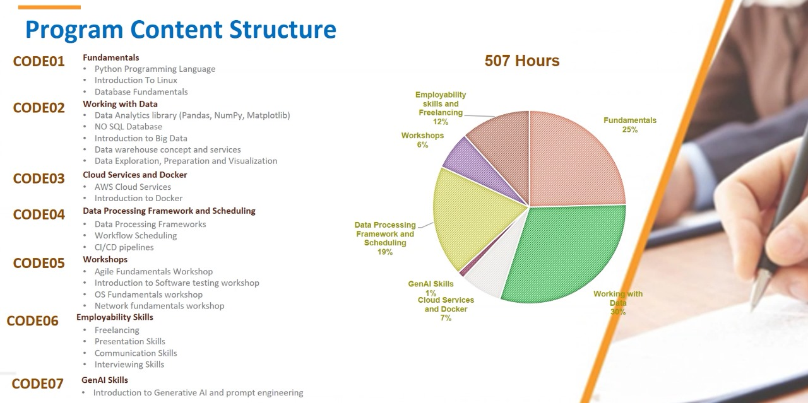

# # ITI Data Engineering Learning Journey

This repository documents my learning progress throughout the ITI Data Engineering program.

## Program Content Structure

## Modules Covered

1. Fundamentals (Python, Linux, Databases)
2. Working with Data (Pandas, NoSQL, Data Warehouse, Visualization)
3. Data Processing & Scheduling (Spark, Airflow, CI/CD)
4. Cloud Services & Docker (AWS, Docker)
5. Workshops (Agile, Testing, OS, Networking)
6. Employability Skills (Communication, Freelancing, CV)
7. GenAI (Prompt Engineering)

Each folder contains notes, scripts, exercises, and summaries related to that part of the course.

## Goals

- Track my learning progress
- Practice through small hands-on projects
- Build a technical portfolio
