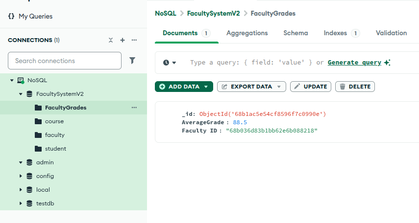
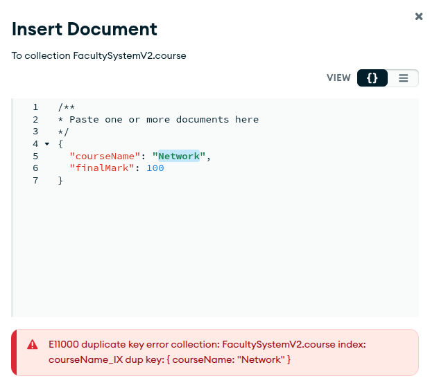

# Lab 02 - NoSQL (MongoDB) - Hussein Mohamed
### Use [FacultySystemV2] DB from previous assignment as following:
```json
- Student: 
{
  "FirstName": "John",
  "LastName": "Doe",
  "IsFired": false,
  "FacultyID": ObjectId("..."),
  "Courses": [
    { "CourseID": ObjectId("..."), "Grade": 85 },
    { "CourseID": ObjectId("..."), "Grade": 92 }
  ]
}

- Faculty:
{
  "FacultyName": "Engineering",
  "Address": "123 Main St"
}

- Course:
{
  "CourseName": "Databases",
  "FinalMark": 100
}
```
## Part 1 - Aggregation Pipeline:
- Task 1: $match + $unwind + $project
  - Retrieve all students who are not fired.
  - Unwind the Courses array.
  - Project only the student's full name, course ID, and grade.
```javascript
[
  {
    $match: {
      isFired: {
        $ne: true
      }
    }
  },
  {
    $unwind: "$courses"
  },
  {
    $project: {
      _id: 0,
      "full Name": {
        $concat: ["$fName", " ", "$lName"]
      },
      courses: 1
    }
  }
]
```


---
- Task 2: $lookup + $project + $sort
  - Join the course data (from Course) using the course ID in each student’s Courses.
  - Show each student’s full name, course name, grade, and course final mark.
  - Sort by grade descending.

```javascript
[
  {
    $lookup:
      /**
       * from: The target collection.
       * localField: The local join field.
       * foreignField: The target join field.
       * as: The name for the results.
       * pipeline: Optional pipeline to run on the foreign collection.
       * let: Optional variables to use in the pipeline field stages.
       */
      {
        from: "course",
        localField: "courses.courseID",
        foreignField: "_id",
        as: "result"
      }
  },
  {
    $project: {
      _id: 0,
      "full Name": {
        $concat: ["$fName", " ", "$lName"]
      },
      "result.courseName": 1,
      "courses.grade": 1,
      "result.finalMark": 1
    }
  },
  {
    $unwind: "$courses"
  },
  {
    $sort:
      /**
       * Provide any number of field/order pairs.
       */
      {
        "courses.grade": -1
      }
  }
]
```


---

- Task 3: $group
  - Calculate the average grade per faculty.
  - Output: { FacultyID, AverageGrade }
  - 
```javascript
[
  {
    $unwind: "$courses"
  },
  {
    $group:
      /**
       * _id: The id of the group.
       * fieldN: The first field name.
       */
      {
        _id: "$facultyID",
        AverageGrade: {
          $avg: "$courses.grade"
        }
      }
  },
  {
    $project: {
      _id: 0,
      "Faculty ID": "$_id",
      AverageGrade: 1
    }
  }
]
```


- Task 4: $out
  - Store the result of Task 3 into a new collection called FacultyGrades.
```javascript
{
$out: "FacultyGrades"
}
```


## Part 2 - Indexing:
- Task 5: Create Indexes
1. Create a regular index on LastName in Student collection to speed up search.
- creating
---


---

- test it

---


---

3. Create a unique index on CourseName in Course to avoid duplicates.
- creating

---


---

- test it
---


---

5. Create a partial index on Student.IsFired == false to optimize frequent queries on active students.
- creating
---


---

- test it
---


---
- code
```javascript
{"isFired":false}
```
